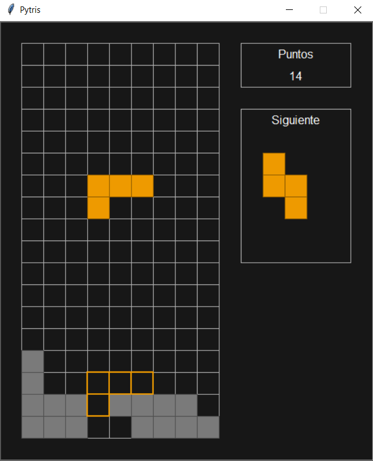
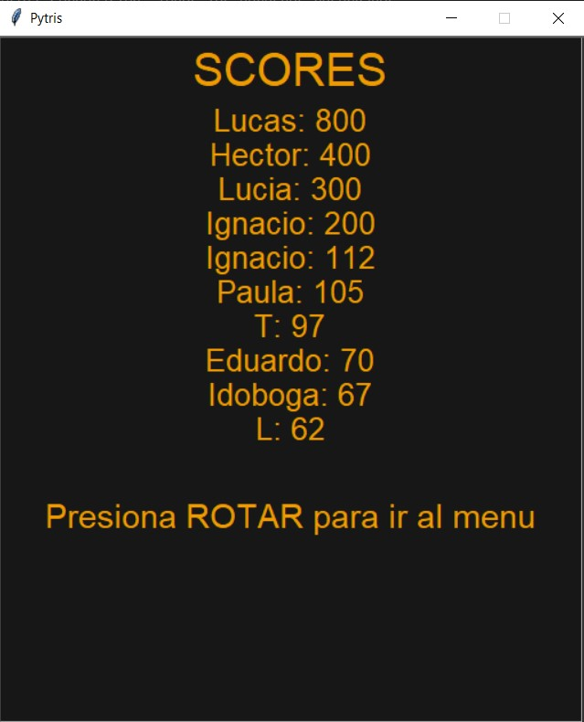

# Descripción

Tetris es un clásico juego de puzzle que desafía la destreza y la habilidad del jugador. En Tetris, piezas de diferentes formas, conocidas como tetrominós, caen desde la parte superior de la pantalla. El objetivo es rotar y colocar estas piezas de manera estratégica para completar líneas horizontales sin dejar espacios vacíos. A medida que el juego avanza, la velocidad aumenta, poniendo a prueba la velocidad de reacción y la capacidad de planificación del jugador.

# Vistas del juego




# Configuracion

## Controles
Para configurar los controles para jugar se debe modificar el archivo ```teclas.txt```.

# Gamelib
Este juego usa el modulo ```Gamelib``` desarrollado por Diego Essaya, el cual se puede encontrar [en este link](https://github.com/dessaya/python-gamelib).